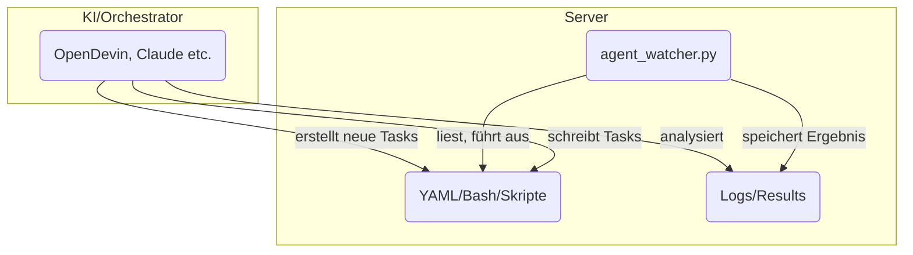

# AG666 Agent Watcher System

## Konzept

Das Ziel dieses Systems ist es, DevOps/Server-Automatisierung so einfach zu machen, dass jeder – auch ohne tiefes Linux- oder Docker-Wissen – komplexe Projekte per YAML, OpenDevin-Agent oder mit Claude/MCP deployen, überwachen und pflegen kann.

**Kernidee:**
Du hast einen (Root-)Server, auf dem ein sogenannter Agent Watcher läuft. Dieser überwacht einen bestimmten Ordner auf YAML-„Instructions". Sobald dort neue Anweisungen (z.B. „deploy project X", „starte Container Y", „setze ENV-Variable…") abgelegt werden, verarbeitet der Agent sie automatisch. Das ist wie ein „Automatisierungs-Gateway" für deine Server, egal ob für Deployment, Monitoring, Self-Healing oder Maintenance.

Das Ganze ist cloud-agnostisch, d.h. läuft auf jedem Linux-Server (z.B. Hetzner, DigitalOcean, AWS, lokal), solange Docker unterstützt wird.

Optional kannst du das System mit OpenDevin oder Claude/MCP in Cursor kombinieren, um per natürlicher Sprache Anweisungen zu erzeugen, Infrastruktur zu scannen und neue Deployments zu steuern.

## Systemübersicht

### Ordnerstruktur

- `/ag666/instructions` – Hier legst du YAML-Dateien mit Automatisierungs-Tasks ab.
- `/ag666/results` – Hier landen die Ergebnisse (Logs, Status, Outputs).
- `/ag666/logs` – (Optional) Für zusätzliche Logfiles des Agenten.

### agent_watcher.py (v2.0)

- Python-Script, das dauerhaft im Hintergrund läuft
- Überwacht instructions und verarbeitet neue YAML-Dateien automatisch
- **NEU in v2.0**: Führt Tasks jetzt wirklich auf dem Server aus!
- Verhindert Doppelverarbeitung per Lock-Mechanismus
- Automatische Backups vor allen Dateiänderungen
- Detaillierte Ausführungslogs in den Ergebnisdateien

### OpenDevin

- (Optional) OpenDevin ist ein KI-gestütztes DevOps/Agenten-Framework
- Kann Anweisungen, Skripte oder komplette Deployment-YAMLs generieren
- Du kannst OpenDevin lokal laufen lassen oder remote einbinden
- Alternativ: Nutzung von Claude (via Cursor MCP) zur Orchestrierung und Steuerung

### Deine Automatisierungs-Tasks

Alles, was du per Bash, Docker, Git, etc. erledigen würdest, kann in YAML beschrieben und automatisch ausgeführt werden:

- Docker-Container bauen/hochfahren
- docker-compose nutzen
- Domains/Subdomains über Reverse Proxy freischalten (Traefik/Nginx)
- ENV-Files ausrollen
- Datenbank-Backups, Monitoring, uvm.

## Schnellstart: Agent Watcher installieren

### 1. Python & Abhängigkeiten installieren

```bash
sudo apt update
sudo apt install python3 python3-pip
pip3 install pyyaml
```

### 2. Ordnerstruktur anlegen

```bash
sudo mkdir -p /ag666/instructions /ag666/results /ag666/logs
sudo chown -R <dein_user>:<dein_user> /ag666
```

### 3. Agent Watcher Script kopieren

agent_watcher.py auf den Server legen, z.B. nach `/ag666/`

Ausführbar machen:
```bash
chmod +x /ag666/agent_watcher.py
```

### 4. Agent Watcher starten

```bash
cd /ag666
python3 agent_watcher.py
```

Der Agent läuft jetzt und wartet auf YAML-Dateien im instructions-Ordner.

### 5. Eine Test-Instruktion ausführen

Lege z.B. eine Datei `test.yaml` in `/ag666/instructions` ab:

```yaml
test: hello
```

Der Agent verarbeitet die Datei automatisch und legt das Ergebnis in `/ag666/results` ab.

## Typische Workflows

**Automatisiertes Deployment:**
YAML-Instruktion für den Bau und Start eines neuen Docker-Containers einwerfen (z.B. für neue Versionen deines Projekts).

**Maintenance:**
YAML-Befehl für Backups, Log-Rotation, Updates, etc.

**Self-Service für Teams:**
Kollegen geben YAML-Tasks vor, die dann zentral ausgeführt werden.

**KI-gestützte Steuerung:**
OpenDevin oder Claude generieren aus „plain English" die nötigen YAMLs und legen sie direkt im instructions-Ordner ab.

## Task-Formate & Beispiele

### 1. Strukturiertes Format (empfohlen für v2.0)

```yaml
task: "Update Traefik Ports"
actions:
  - type: update_docker_compose_ports
    file: /root/-hrthis-deployment/docker-compose.deploy.yml
    service: traefik
    port_mappings:
      - "8081:80"
      - "8082:443"
```

### 2. Multi-Action Tasks

```yaml
task: "Deploy neue Version"
actions:
  - type: copy_file
    source: /app/config/production.yml
    destination: /backups/production.yml.backup
    
  - type: run_command
    command: "cd /app && git pull origin main"
    timeout: 60
    
  - type: run_command
    command: "docker-compose restart"
    timeout: 120
```

### 3. Einfacher Befehl

```yaml
command: "docker ps | grep traefik"
```

### Verfügbare Aktionstypen

- **update_docker_compose_ports**: Port-Mappings in Docker-Compose-Dateien ändern
- **run_command**: Shell-Befehle mit optionalem Timeout ausführen
- **edit_file**: Dateien per Suchen/Ersetzen bearbeiten (mit Regex-Support)
- **copy_file**: Dateien kopieren
- **create_file**: Neue Dateien mit Inhalt erstellen
- **delete_file**: Dateien löschen (erstellt automatisch Backup)

## OpenDevin-Integration & Systemkonzept

Dieses System ist als flexibler Automations-Layer gedacht, der durch die Kombination von agent_watcher.py (dem Watcher/Executor auf dem Server) und einer KI-gestützten Orchestrierung (empfohlen: OpenDevin) besonders mächtig wird.

### Warum OpenDevin?

OpenDevin ist ein Open-Source-Agentensystem, das DevOps- und Deployment-Aufgaben automatisieren kann.

Die KI kann per natürlicher Sprache und/oder UI gezielt Aufgaben generieren, als YAML- oder Bash-Anweisungen speichern und direkt dem Watcher zur Ausführung bereitstellen.

Der Agent Watcher liest diese Anweisungen automatisiert aus einem Verzeichnis (/ag666/instructions) ein, führt sie aus und schreibt die Ergebnisse/Logs zurück.

**Vorteile der Integration:**

- Komplett automatisierte Self-Service-DevOps-Pipeline
- Aufgaben können per KI (OpenDevin, Claude, GPT-4o etc.) generiert, verwaltet und überwacht werden
- Kein händisches Schreiben von Shell- oder Deployment-Skripten mehr nötig
- Einfach erweiterbar für weitere Use-Cases (z.B. Serververwaltung, Deployments, Monitoring etc.)

### System-Architektur



### Hinweise zur Nutzung

Ohne OpenDevin kannst du das System auch nutzen, musst dann aber alle Tasks manuell als YAML/Bash in `/ag666/instructions` ablegen.

Empfohlen: Nutze OpenDevin oder ein ähnliches Tool (z.B. Claude in Cursor), um Anweisungen KI-gestützt zu erstellen, Server-Feedback auszuwerten und die Automatisierung kontinuierlich zu verbessern.

### OpenDevin installieren

Eine Anleitung zur Installation von OpenDevin findest du hier:
https://github.com/OpenDevin/OpenDevin

Nach dem Setup kannst du OpenDevin so konfigurieren, dass es automatisch Aufgaben im Instructions-Ordner ablegt oder direkt mit dem Agent Watcher kommuniziert.

## Features

### Version 2.0 - Echte Task-Ausführung!
- ⚡ **NEU**: Führt Tasks jetzt wirklich auf dem Server aus (nicht nur Logging)
- 🛠️ **NEU**: Modulare Aktionstypen für verschiedene Aufgaben
- 💾 **NEU**: Automatische Backups vor allen Dateioperationen
- 📋 **NEU**: Strukturiertes Task-Format mit expliziten Aktionen

### Basis-Features
- 🔍 Kontinuierliche Überwachung des Verzeichnisses `/ag666/instructions`
- 🔒 Lock-Mechanismus verhindert Mehrfachverarbeitung durch Umbenennung in `.lock`
- 📄 Automatisches Parsen und Verarbeiten von YAML-Dateien
- 📊 Ergebnisse werden als YAML in `/ag666/results` gespeichert
- 🛡️ Robuste Fehlerbehandlung - Script läuft auch bei fehlerhaften Dateien weiter
- 📝 Detaillierte Ausführungslogs mit Timestamps

## Sicherheit & Hinweise

⚠️ Der Agent führt alles aus, was in YAML im instructions-Ordner landet – Zugriff sollte also nur für vertrauenswürdige User/Agenten erlaubt sein!

Die Idee ist, wiederholbare, dokumentierte DevOps/Automatisierungen zu ermöglichen, ohne sich im Detail mit jedem Tool auskennen zu müssen.

## Erweiterungen & Roadmap

- Weiterentwicklung Richtung ChatOps/VoiceOps möglich (z.B. Integration mit Slack, Telegram, Discord)
- Einbindung von Monitoring, Healthchecks und Self-Healing via Agent denkbar
- Kompatibel mit jedem modernen CI/CD-Prozess

## Das AG666 Master-Handbuch: Deine persönliche Server-Automationsplattform

### 1. Die Philosophie und das Konzept

**Das Ziel:** Du musst dich nie wieder per SSH einloggen, um Routineaufgaben zu erledigen. Du sprichst mit einer KI (Claude), diese erstellt eine Arbeitsanweisung (YAML), und dein Server führt sie autonom aus. Du bekommst nur noch das Ergebnis per Telegram.

#### Die drei Säulen deines Systems:

**Claude in Cursor (Der Architekt):**
- **Rolle:** Dein kreativer Partner. Er übersetzt deine Ziele ("Ich will Projekt X deployen") in eine exakte, maschinenlesbare Blaupause (die YAML-Datei).
- **Standort:** Lokal auf deinem Mac.
- **Output:** Eine .yaml-Datei, die er im Ordner ~/ag666_tasks auf deinem Mac ablegt.

**Syncthing (Der Logistiker):**
- **Rolle:** Der vollautomatische, unsichtbare Kurier. Er bemerkt jede neue oder geänderte Datei in ~/ag666_tasks auf deinem Mac und transportiert sie sofort und verschlüsselt zum Server.
- **Standort:** Läuft als Dienst auf Mac und Server.
- **Output:** Eine exakte Kopie der Datei im "Eingangskorb" des Agenten auf dem Server: /ag666/instructions.

**AG666 Agent (Der Executor):**
- **Rolle:** Der zuverlässige Arbeiter auf dem Server. Er schaut nur in seinen Eingangskorb (/ag666/instructions). Findet er eine neue Anweisung, führt er sie ohne Nachfragen aus.
- **Standort:** Läuft als systemd-Dienst permanent auf deinem Hetzner-Server.
- **Output:** Eine Ergebnis-Datei in /ag666/results und eine Status-Benachrichtigung per Telegram.

### 2. Der Standard-Workflow: Von der Idee zur Ausführung

#### Schritt 1: Formuliere den Auftrag für Claude (im Cursor-Chat)

Sei so präzise wie möglich. Eine gute Formel ist: **ZIEL, AKTION, PARAMETER, SPEICHERORT.**

**Beispiel-Prompt (simpel):**
```
Erstelle mir einen AG666-Task als YAML, der den Docker-Container hrthis-db neustartet. 
Nutze die Aktion restart_docker_container. 
Speichere die Datei bitte als restart_db.yaml in meinem lokalen Ordner ~/ag666_tasks.
```

**Beispiel-Prompt (komplex):**
```
Erstelle einen AG666-Task mit mehreren Aktionen. Zuerst soll die Datei /etc/nginx/nginx.conf 
gesichert werden, indem sie nach /etc/nginx/nginx.conf.bak kopiert wird. Danach soll in der 
Originaldatei der Wert worker_processes 4; durch worker_processes auto; ersetzt werden. 
Zum Schluss soll der Befehl systemctl reload nginx ausgeführt werden. 
Speichere das als optimize_nginx.yaml in ~/ag666_tasks.
```

#### Schritt 2: Claude die YAML generieren und speichern lassen

**Beispiel-YAML für den komplexen Prompt:**
```yaml
task: "Nginx-Konfiguration optimieren und neuladen"
actions:
  - type: copy_file
    source: /etc/nginx/nginx.conf
    destination: /etc/nginx/nginx.conf.bak
  - type: edit_file
    file: /etc/nginx/nginx.conf
    search: "worker_processes 4;"
    replace: "worker_processes auto;"
  - type: run_command
    command: "systemctl reload nginx"
```

#### Schritt 3: Zurücklehnen und auf Telegram warten

In dem Moment, in dem die Datei in ~/ag666_tasks gespeichert wird, beginnt die Kette:
**Syncthing → Server → AG666 Agent → Telegram.**

### 3. Fehlerbehandlung: Was tun, wenn etwas schiefgeht?

#### Szenario 1: Es kommt keine Telegram-Nachricht an

**Ist der Postbote im Dienst?**
- Check: Funktioniert Syncthing? Öffne die beiden Web-UIs (Mac und Server via Tunnel).
- Fix: `brew services restart syncthing` auf dem Mac, `sudo systemctl restart syncthing@root.service` auf dem Server.

**Ist der Arbeiter im Dienst?**
- Check: `sudo systemctl status ag666-agent`
- Fix: `sudo systemctl restart ag666-agent`

**Ist die Anweisung angekommen?**
- Check: `ls -l /ag666/instructions/`

#### Szenario 2: Es kommt eine FEHLER-Nachricht in Telegram

Das ist ein gutes Zeichen! Der Agent hat gearbeitet, aber etwas ist schiefgelaufen.

1. Lies die Fehlermeldung in Telegram
2. Schau in die Ergebnis-Datei: `cat /ag666/results/dein_task_name.yaml`
3. Achte auf die Felder `summary`, `error` und `execution_logs`
4. Behebe die Ursache und lasse Claude eine korrigierte YAML erstellen

### 4. Die Werkzeugkiste: Deine verfügbaren Aktionen

| Aktionstyp | Beschreibung | Beispiel-Parameter |
|------------|--------------|-------------------|
| `run_command` | Führt einen beliebigen Shell-Befehl aus | `command: "docker ps -a"` |
| `restart_docker_container` | Startet einen Docker-Container neu | `container: hrthis-backend` |
| `update_docker_compose_ports` | Ändert Ports in docker-compose.yml | `file: path/to/compose.yml, service: traefik, port_mappings: ["8081:80", "8082:443"]` |
| `edit_file` | Sucht und ersetzt Text in einer Datei | `file: path/to/file.txt, search: "alt", replace: "neu"` |
| `create_file` | Erstellt eine neue Datei mit Inhalt | `file: path/to/new_file.txt, content: "Hallo Welt"` |
| `copy_file` | Kopiert eine Datei | `source: path/to/source, destination: path/to/dest` |
| `delete_file` | Löscht eine Datei (erstellt vorher ein Backup) | `file: path/to/file_to_delete.txt` |

### 5. Das ultimative AG666-Prompt-Template für Claude

```
Du bist mein persönlicher DevOps-Agent für mein AG666-System. Deine Aufgabe ist es, eine präzise und fehlerfreie YAML-Taskdatei zu erstellen, die mein agent_watcher.py auf dem Server ausführen kann.

**1. Kontext und Ziel:**
Ich möchte [HIER DAS ZIEL IN KLARTEXT BESCHREIBEN].

**2. Benötigte Aktionen:**
Führe die folgenden Aktionen in exakt dieser Reihenfolge aus:

* **Aktion 1:** [BESCHREIBUNG]
  * **Typ:** `[AKTIONSTYP]`
  * **Parameter:** [PARAMETER]

**3. Formatierungs-Anweisungen:**
* Erstelle eine einzelne YAML-Datei
* Gib der Aufgabe einen klaren Namen im `task`-Feld
* Stelle sicher, dass die YAML-Syntax zu 100% korrekt ist

**4. Speicherort und Dateiname:**
Speichere die fertige YAML-Datei in `~/ag666_tasks` unter dem Dateinamen `[DATEINAME].yaml`.

Gib mir nur den reinen YAML-Code als finale Antwort zurück, ohne zusätzliche Erklärungen.
```

### 6. Syncthing-Verbindung lost - Was tun?

Die Fehlermeldung `ERR_CONNECTION_REFUSED` bei `http://127.0.0.1:9090` bedeutet: Der SSH-Tunnel ist nicht mehr aktiv.

**Reparatur:**
1. Öffne ein neues Mac-Terminal-Fenster
2. Gib ein: `ssh -L 9090:127.0.0.1:8384 root@[DEINE-SERVER-IP]`
3. Lasse das Terminal-Fenster offen während der Arbeit
4. Lade `http://127.0.0.1:9090` im Browser neu

**Merke dir:**
- `http://127.0.0.1:8384` → Syncthing auf deinem Mac (immer verfügbar)
- `http://127.0.0.1:9090` → Syncthing auf dem Server (nur mit SSH-Tunnel)

## Viel Spaß beim Automatisieren!

Fragen, Bugs oder Erweiterungswünsche gerne via Issue oder direkt an den Maintainer.