# AG666 Agent Watcher System

## Konzept

Das Ziel dieses Systems ist es, DevOps/Server-Automatisierung so einfach zu machen, dass jeder – auch ohne tiefes Linux- oder Docker-Wissen – komplexe Projekte per YAML, OpenDevin-Agent oder mit Claude/MCP deployen, überwachen und pflegen kann.

**Kernidee:**
Du hast einen (Root-)Server, auf dem ein sogenannter Agent Watcher läuft. Dieser überwacht einen bestimmten Ordner auf YAML-„Instructions". Sobald dort neue Anweisungen (z.B. „deploy project X", „starte Container Y", „setze ENV-Variable…") abgelegt werden, verarbeitet der Agent sie automatisch. Das ist wie ein „Automatisierungs-Gateway" für deine Server, egal ob für Deployment, Monitoring, Self-Healing oder Maintenance.

Das Ganze ist cloud-agnostisch, d.h. läuft auf jedem Linux-Server (z.B. Hetzner, DigitalOcean, AWS, lokal), solange Docker unterstützt wird.

Optional kannst du das System mit OpenDevin oder Claude/MCP in Cursor kombinieren, um per natürlicher Sprache Anweisungen zu erzeugen, Infrastruktur zu scannen und neue Deployments zu steuern.

## Systemübersicht

### Ordnerstruktur

- `/ag666/instructions` – Hier legst du YAML-Dateien mit Automatisierungs-Tasks ab.
- `/ag666/results` – Hier landen die Ergebnisse (Logs, Status, Outputs).
- `/ag666/logs` – (Optional) Für zusätzliche Logfiles des Agenten.

### agent_watcher.py (v2.0)

- Python-Script, das dauerhaft im Hintergrund läuft
- Überwacht instructions und verarbeitet neue YAML-Dateien automatisch
- **NEU in v2.0**: Führt Tasks jetzt wirklich auf dem Server aus!
- Verhindert Doppelverarbeitung per Lock-Mechanismus
- Automatische Backups vor allen Dateiänderungen
- Detaillierte Ausführungslogs in den Ergebnisdateien

### OpenDevin

- (Optional) OpenDevin ist ein KI-gestütztes DevOps/Agenten-Framework
- Kann Anweisungen, Skripte oder komplette Deployment-YAMLs generieren
- Du kannst OpenDevin lokal laufen lassen oder remote einbinden
- Alternativ: Nutzung von Claude (via Cursor MCP) zur Orchestrierung und Steuerung

### Deine Automatisierungs-Tasks

Alles, was du per Bash, Docker, Git, etc. erledigen würdest, kann in YAML beschrieben und automatisch ausgeführt werden:

- Docker-Container bauen/hochfahren
- docker-compose nutzen
- Domains/Subdomains über Reverse Proxy freischalten (Traefik/Nginx)
- ENV-Files ausrollen
- Datenbank-Backups, Monitoring, uvm.

## Schnellstart: Agent Watcher installieren

### 1. Python & Abhängigkeiten installieren

```bash
sudo apt update
sudo apt install python3 python3-pip
pip3 install pyyaml
```

### 2. Ordnerstruktur anlegen

```bash
sudo mkdir -p /ag666/instructions /ag666/results /ag666/logs
sudo chown -R <dein_user>:<dein_user> /ag666
```

### 3. Agent Watcher Script kopieren

agent_watcher.py auf den Server legen, z.B. nach `/ag666/`

Ausführbar machen:
```bash
chmod +x /ag666/agent_watcher.py
```

### 4. Agent Watcher starten

```bash
cd /ag666
python3 agent_watcher.py
```

Der Agent läuft jetzt und wartet auf YAML-Dateien im instructions-Ordner.

### 5. Eine Test-Instruktion ausführen

Lege z.B. eine Datei `test.yaml` in `/ag666/instructions` ab:

```yaml
test: hello
```

Der Agent verarbeitet die Datei automatisch und legt das Ergebnis in `/ag666/results` ab.

## Typische Workflows

**Automatisiertes Deployment:**
YAML-Instruktion für den Bau und Start eines neuen Docker-Containers einwerfen (z.B. für neue Versionen deines Projekts).

**Maintenance:**
YAML-Befehl für Backups, Log-Rotation, Updates, etc.

**Self-Service für Teams:**
Kollegen geben YAML-Tasks vor, die dann zentral ausgeführt werden.

**KI-gestützte Steuerung:**
OpenDevin oder Claude generieren aus „plain English" die nötigen YAMLs und legen sie direkt im instructions-Ordner ab.

## Task-Formate & Beispiele

### 1. Strukturiertes Format (empfohlen für v2.0)

```yaml
task: "Update Traefik Ports"
actions:
  - type: update_docker_compose_ports
    file: /root/-hrthis-deployment/docker-compose.deploy.yml
    service: traefik
    port_mappings:
      - "8081:80"
      - "8082:443"
```

### 2. Multi-Action Tasks

```yaml
task: "Deploy neue Version"
actions:
  - type: copy_file
    source: /app/config/production.yml
    destination: /backups/production.yml.backup
    
  - type: run_command
    command: "cd /app && git pull origin main"
    timeout: 60
    
  - type: run_command
    command: "docker-compose restart"
    timeout: 120
```

### 3. Einfacher Befehl

```yaml
command: "docker ps | grep traefik"
```

### Verfügbare Aktionstypen

- **update_docker_compose_ports**: Port-Mappings in Docker-Compose-Dateien ändern
- **run_command**: Shell-Befehle mit optionalem Timeout ausführen
- **edit_file**: Dateien per Suchen/Ersetzen bearbeiten (mit Regex-Support)
- **copy_file**: Dateien kopieren
- **create_file**: Neue Dateien mit Inhalt erstellen
- **delete_file**: Dateien löschen (erstellt automatisch Backup)

## OpenDevin-Integration & Systemkonzept

Dieses System ist als flexibler Automations-Layer gedacht, der durch die Kombination von agent_watcher.py (dem Watcher/Executor auf dem Server) und einer KI-gestützten Orchestrierung (empfohlen: OpenDevin) besonders mächtig wird.

### Warum OpenDevin?

OpenDevin ist ein Open-Source-Agentensystem, das DevOps- und Deployment-Aufgaben automatisieren kann.

Die KI kann per natürlicher Sprache und/oder UI gezielt Aufgaben generieren, als YAML- oder Bash-Anweisungen speichern und direkt dem Watcher zur Ausführung bereitstellen.

Der Agent Watcher liest diese Anweisungen automatisiert aus einem Verzeichnis (/ag666/instructions) ein, führt sie aus und schreibt die Ergebnisse/Logs zurück.

**Vorteile der Integration:**

- Komplett automatisierte Self-Service-DevOps-Pipeline
- Aufgaben können per KI (OpenDevin, Claude, GPT-4o etc.) generiert, verwaltet und überwacht werden
- Kein händisches Schreiben von Shell- oder Deployment-Skripten mehr nötig
- Einfach erweiterbar für weitere Use-Cases (z.B. Serververwaltung, Deployments, Monitoring etc.)

### System-Architektur

```mermaid
graph TD
    subgraph KI/Orchestrator
        A(OpenDevin, Claude etc.)
    end
    subgraph Server
        B(agent_watcher.py)
        C(YAML/Bash/Skripte)
        D(Logs/Results)
    end
    A -- schreibt Tasks --> C
    B -- liest, führt aus --> C
    B -- speichert Ergebnis --> D
    A -- analysiert --> D
    A -- erstellt neue Tasks --> C
```



### Hinweise zur Nutzung

Ohne OpenDevin kannst du das System auch nutzen, musst dann aber alle Tasks manuell als YAML/Bash in `/ag666/instructions` ablegen.

Empfohlen: Nutze OpenDevin oder ein ähnliches Tool (z.B. Claude in Cursor), um Anweisungen KI-gestützt zu erstellen, Server-Feedback auszuwerten und die Automatisierung kontinuierlich zu verbessern.

### OpenDevin installieren

Eine Anleitung zur Installation von OpenDevin findest du hier:
https://github.com/OpenDevin/OpenDevin

Nach dem Setup kannst du OpenDevin so konfigurieren, dass es automatisch Aufgaben im Instructions-Ordner ablegt oder direkt mit dem Agent Watcher kommuniziert.

## Features

### Version 2.0 - Echte Task-Ausführung!
- ⚡ **NEU**: Führt Tasks jetzt wirklich auf dem Server aus (nicht nur Logging)
- 🛠️ **NEU**: Modulare Aktionstypen für verschiedene Aufgaben
- 💾 **NEU**: Automatische Backups vor allen Dateioperationen
- 📋 **NEU**: Strukturiertes Task-Format mit expliziten Aktionen

### Basis-Features
- 🔍 Kontinuierliche Überwachung des Verzeichnisses `/ag666/instructions`
- 🔒 Lock-Mechanismus verhindert Mehrfachverarbeitung durch Umbenennung in `.lock`
- 📄 Automatisches Parsen und Verarbeiten von YAML-Dateien
- 📊 Ergebnisse werden als YAML in `/ag666/results` gespeichert
- 🛡️ Robuste Fehlerbehandlung - Script läuft auch bei fehlerhaften Dateien weiter
- 📝 Detaillierte Ausführungslogs mit Timestamps

## Sicherheit & Hinweise

⚠️ Der Agent führt alles aus, was in YAML im instructions-Ordner landet – Zugriff sollte also nur für vertrauenswürdige User/Agenten erlaubt sein!

Die Idee ist, wiederholbare, dokumentierte DevOps/Automatisierungen zu ermöglichen, ohne sich im Detail mit jedem Tool auskennen zu müssen.

## Erweiterungen & Roadmap

- Weiterentwicklung Richtung ChatOps/VoiceOps möglich (z.B. Integration mit Slack, Telegram, Discord)
- Einbindung von Monitoring, Healthchecks und Self-Healing via Agent denkbar
- Kompatibel mit jedem modernen CI/CD-Prozess

## Viel Spaß beim Automatisieren!

Fragen, Bugs oder Erweiterungswünsche gerne via Issue oder direkt an den Maintainer.