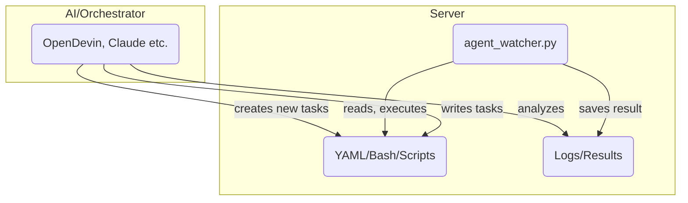

# AG666 Agent Watcher System

## Concept

The goal of this system is to make DevOps/server automation so simple that anyone - even without deep Linux or Docker knowledge - can deploy, monitor, and maintain complex projects via YAML, OpenDevin Agent, or with Claude/MCP.

**Core Idea:**
You have a (root) server running a so-called Agent Watcher. This monitors a specific folder for YAML "Instructions". As soon as new instructions (e.g., "deploy project X", "start container Y", "set ENV variable...") are placed there, the agent processes them automatically. It's like an "automation gateway" for your servers, whether for deployment, monitoring, self-healing, or maintenance.

The whole system is cloud-agnostic, meaning it runs on any Linux server (e.g., Hetzner, DigitalOcean, AWS, local), as long as Docker is supported.

Optionally, you can combine the system with OpenDevin or Claude/MCP in Cursor to generate instructions using natural language, scan infrastructure, and control new deployments.

## System Overview

### Directory Structure

- `/ag666/instructions` – Place YAML files with automation tasks here
- `/ag666/results` – Results land here (logs, status, outputs)
- `/ag666/logs` – (Optional) For additional agent log files

### agent_watcher.py (v2.0)

- Python script that runs permanently in the background
- Monitors instructions and automatically processes new YAML files
- **NEW in v2.0**: Now actually executes tasks on the server!
- Prevents double processing via lock mechanism
- Automatic backups before all file modifications
- Detailed execution logs in result files

### OpenDevin

- (Optional) OpenDevin is an AI-powered DevOps/agent framework
- Can generate instructions, scripts, or complete deployment YAMLs
- You can run OpenDevin locally or integrate it remotely
- Alternative: Use Claude (via Cursor MCP) for orchestration and control

### Your Automation Tasks

Everything you would do via Bash, Docker, Git, etc., can be described in YAML and executed automatically:

- Build/start Docker containers
- Use docker-compose
- Enable domains/subdomains via reverse proxy (Traefik/Nginx)
- Deploy ENV files
- Database backups, monitoring, and much more

## Quick Start: Install Agent Watcher

### 1. Install Python & Dependencies

```bash
sudo apt update
sudo apt install python3 python3-pip
pip3 install pyyaml
```

### 2. Create Directory Structure

```bash
sudo mkdir -p /ag666/instructions /ag666/results /ag666/logs
sudo chown -R <your_user>:<your_user> /ag666
```

### 3. Copy Agent Watcher Script

Place agent_watcher.py on the server, e.g., to `/ag666/`

Make it executable:
```bash
chmod +x /ag666/agent_watcher.py
```

### 4. Start Agent Watcher

```bash
cd /ag666
python3 agent_watcher.py
```

The agent is now running and waiting for YAML files in the instructions folder.

### 5. Execute a Test Instruction

For example, place a file `test.yaml` in `/ag666/instructions`:

```yaml
test: hello
```

The agent automatically processes the file and places the result in `/ag666/results`.

## Typical Workflows

**Automated Deployment:**
Drop YAML instructions for building and starting a new Docker container (e.g., for new versions of your project).

**Maintenance:**
YAML commands for backups, log rotation, updates, etc.

**Self-Service for Teams:**
Colleagues provide YAML tasks that are then executed centrally.

**AI-Powered Control:**
OpenDevin or Claude generate the necessary YAMLs from "plain English" and place them directly in the instructions folder.

## Task Formats & Examples

### 1. Structured Format (recommended for v2.0)

```yaml
task: "Update Traefik Ports"
actions:
  - type: update_docker_compose_ports
    file: /root/-hrthis-deployment/docker-compose.deploy.yml
    service: traefik
    port_mappings:
      - "8081:80"
      - "8082:443"
```

### 2. Multi-Action Tasks

```yaml
task: "Deploy new version"
actions:
  - type: copy_file
    source: /app/config/production.yml
    destination: /backups/production.yml.backup
    
  - type: run_command
    command: "cd /app && git pull origin main"
    timeout: 60
    
  - type: run_command
    command: "docker-compose restart"
    timeout: 120
```

### 3. Simple Command

```yaml
command: "docker ps | grep traefik"
```

### Available Action Types

- **update_docker_compose_ports**: Modify port mappings in Docker Compose files
- **run_command**: Execute shell commands with optional timeout
- **edit_file**: Edit files via search/replace (with regex support)
- **copy_file**: Copy files
- **create_file**: Create new files with content
- **delete_file**: Delete files (automatically creates backup)

## OpenDevin Integration & System Concept

This system is designed as a flexible automation layer that becomes particularly powerful through the combination of agent_watcher.py (the watcher/executor on the server) and AI-powered orchestration (recommended: OpenDevin).

### Why OpenDevin?

OpenDevin is an open-source agent system that can automate DevOps and deployment tasks.

The AI can generate targeted tasks via natural language and/or UI, save them as YAML or Bash instructions, and provide them directly to the watcher for execution.

The Agent Watcher automatically reads these instructions from a directory (/ag666/instructions), executes them, and writes back the results/logs.

**Benefits of Integration:**

- Fully automated self-service DevOps pipeline
- Tasks can be generated, managed, and monitored via AI (OpenDevin, Claude, GPT-4o, etc.)
- No more manual writing of shell or deployment scripts needed
- Easily extensible for additional use cases (e.g., server management, deployments, monitoring, etc.)

### System Architecture



### Usage Notes

Without OpenDevin, you can still use the system, but you'll need to manually place all tasks as YAML/Bash in `/ag666/instructions`.

Recommended: Use OpenDevin or a similar tool (e.g., Claude in Cursor) to create AI-powered instructions, evaluate server feedback, and continuously improve automation.

### Install OpenDevin

You can find installation instructions for OpenDevin here:
https://github.com/OpenDevin/OpenDevin

After setup, you can configure OpenDevin to automatically place tasks in the instructions folder or communicate directly with the Agent Watcher.

## Features

### Version 2.0 - Real Task Execution!
- ⚡ **NEW**: Now actually executes tasks on the server (not just logging)
- 🛠️ **NEW**: Modular action types for various tasks
- 💾 **NEW**: Automatic backups before all file operations
- 📋 **NEW**: Structured task format with explicit actions

### Core Features
- 🔍 Continuous monitoring of the `/ag666/instructions` directory
- 🔒 Lock mechanism prevents double processing by renaming to `.lock`
- 📄 Automatic parsing and processing of YAML files
- 📊 Results are saved as YAML in `/ag666/results`
- 🛡️ Robust error handling - script continues running even with faulty files
- 📝 Detailed execution logs with timestamps

## Security & Notes

⚠️ The agent executes everything placed as YAML in the instructions folder - access should only be allowed for trusted users/agents!

The idea is to enable repeatable, documented DevOps/automation without needing to know every tool in detail.

## Extensions & Roadmap

- Further development towards ChatOps/VoiceOps possible (e.g., integration with Slack, Telegram, Discord)
- Integration of monitoring, health checks, and self-healing via agent conceivable
- Compatible with any modern CI/CD process

## The AG666 Master Guide: Your Personal Server Automation Platform

### 1. Philosophy and Concept

**The Goal:** You never need to SSH into your server again for routine tasks. You talk to an AI (Claude), it creates work instructions (YAML), and your server executes them autonomously. You only get the results via Telegram.

#### The Three Pillars of Your System:

**Claude in Cursor (The Architect):**
- **Role:** Your creative partner. Translates your goals ("I want to deploy project X") into exact, machine-readable blueprints (YAML files).
- **Location:** Local on your Mac.
- **Output:** A .yaml file saved in the ~/ag666_tasks folder on your Mac.

**Syncthing (The Logistics Coordinator):**
- **Role:** The fully automatic, invisible courier. Notices every new or changed file in ~/ag666_tasks on your Mac and transports it immediately and encrypted to the server.
- **Location:** Runs as a service on Mac and server.
- **Output:** An exact copy of the file in the agent's "inbox" on the server: /ag666/instructions.

**AG666 Agent (The Executor):**
- **Role:** The reliable worker on the server. Only checks its inbox (/ag666/instructions). When it finds a new instruction, it executes it without questions.
- **Location:** Runs as a systemd service permanently on your server.
- **Output:** A result file in /ag666/results and a status notification via Telegram.

### 2. Standard Workflow: From Idea to Execution

#### Step 1: Formulate the Task for Claude (in Cursor Chat)

Be as precise as possible. A good formula is: **GOAL, ACTION, PARAMETERS, STORAGE LOCATION.**

**Example Prompt (simple):**
```
Create an AG666 task as YAML that restarts the Docker container hrthis-db. 
Use the restart_docker_container action. 
Please save the file as restart_db.yaml in my local folder ~/ag666_tasks.
```

**Example Prompt (complex):**
```
Create an AG666 task with multiple actions. First, the file /etc/nginx/nginx.conf 
should be backed up by copying it to /etc/nginx/nginx.conf.bak. Then, in the 
original file, the value worker_processes 4; should be replaced with worker_processes auto;. 
Finally, the command systemctl reload nginx should be executed. 
Save this as optimize_nginx.yaml in ~/ag666_tasks.
```

#### Step 2: Let Claude Generate and Save the YAML

**Example YAML for the complex prompt:**
```yaml
task: "Optimize Nginx configuration and reload"
actions:
  - type: copy_file
    source: /etc/nginx/nginx.conf
    destination: /etc/nginx/nginx.conf.bak
  - type: edit_file
    file: /etc/nginx/nginx.conf
    search: "worker_processes 4;"
    replace: "worker_processes auto;"
  - type: run_command
    command: "systemctl reload nginx"
```

#### Step 3: Sit Back and Wait for Telegram

The moment the file is saved in ~/ag666_tasks, the chain begins:
**Syncthing → Server → AG666 Agent → Telegram.**

### 3. Error Handling: What to Do When Something Goes Wrong

#### Scenario 1: No Telegram Message Arrives

**Is the courier on duty?**
- Check: Is Syncthing working? Open both web UIs (Mac and server via tunnel).
- Fix: `brew services restart syncthing` on Mac, `sudo systemctl restart syncthing@root.service` on server.

**Is the worker on duty?**
- Check: `sudo systemctl status ag666-agent`
- Fix: `sudo systemctl restart ag666-agent`

**Did the instruction arrive?**
- Check: `ls -l /ag666/instructions/`

#### Scenario 2: An ERROR Message Arrives in Telegram

This is a good sign! The agent worked, but something went wrong.

1. Read the error message in Telegram
2. Check the result file: `cat /ag666/results/your_task_name.yaml`
3. Look at the `summary`, `error`, and `execution_logs` fields
4. Fix the cause and have Claude create a corrected YAML

### 4. The Toolbox: Your Available Actions

| Action Type | Description | Example Parameters |
|-------------|-------------|-------------------|
| `run_command` | Executes any shell command | `command: "docker ps -a"` |
| `restart_docker_container` | Restarts a Docker container | `container: hrthis-backend` |
| `update_docker_compose_ports` | Changes ports in docker-compose.yml | `file: path/to/compose.yml, service: traefik, port_mappings: ["8081:80", "8082:443"]` |
| `edit_file` | Search and replace text in a file | `file: path/to/file.txt, search: "old", replace: "new"` |
| `create_file` | Creates a new file with content | `file: path/to/new_file.txt, content: "Hello World"` |
| `copy_file` | Copies a file | `source: path/to/source, destination: path/to/dest` |
| `delete_file` | Deletes a file (creates backup first) | `file: path/to/file_to_delete.txt` |

### 5. The Ultimate AG666 Prompt Template for Claude

```
You are my personal DevOps agent for my AG666 system. Your task is to create a precise and error-free YAML task file that my agent_watcher.py can execute on the server.

**1. Context and Goal:**
I want to [DESCRIBE THE GOAL IN PLAIN TEXT HERE].

**2. Required Actions:**
Execute the following actions in exactly this order:

* **Action 1:** [DESCRIPTION]
  * **Type:** `[ACTION_TYPE]`
  * **Parameters:** [PARAMETERS]

**3. Formatting Instructions:**
* Create a single YAML file
* Give the task a clear name in the `task` field
* Ensure the YAML syntax is 100% correct

**4. Storage Location and Filename:**
Save the finished YAML file in `~/ag666_tasks` with the filename `[FILENAME].yaml`.

Give me only the pure YAML code as the final answer, without additional explanations.
```

### 6. Syncthing Connection Lost - What to Do?

The error message `ERR_CONNECTION_REFUSED` at `http://127.0.0.1:9090` means: The SSH tunnel is no longer active.

**Repair:**
1. Open a new Mac Terminal window
2. Enter: `ssh -L 9090:127.0.0.1:8384 root@[YOUR-SERVER-IP]`
3. Keep the Terminal window open during work
4. Reload `http://127.0.0.1:9090` in the browser

**Remember:**
- `http://127.0.0.1:8384` → Syncthing on your Mac (always available)
- `http://127.0.0.1:9090` → Syncthing on the server (only with SSH tunnel)

## Enjoy Automating!

Questions, bugs, or feature requests are welcome via issues or directly to the maintainer.