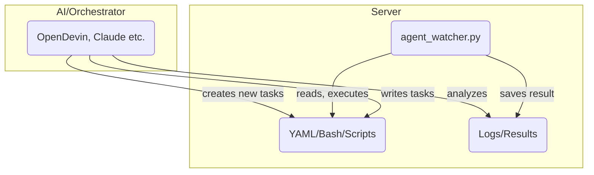

# AG666 Agent Watcher System

## Concept

The goal of this system is to make DevOps/server automation so simple that anyone - even without deep Linux or Docker knowledge - can deploy, monitor, and maintain complex projects via YAML, OpenDevin Agent, or with Claude/MCP.

**Core Idea:**
You have a (root) server running a so-called Agent Watcher. This monitors a specific folder for YAML "Instructions". As soon as new instructions (e.g., "deploy project X", "start container Y", "set ENV variable...") are placed there, the agent processes them automatically. It's like an "automation gateway" for your servers, whether for deployment, monitoring, self-healing, or maintenance.

The whole system is cloud-agnostic, meaning it runs on any Linux server (e.g., Hetzner, DigitalOcean, AWS, local), as long as Docker is supported.

Optionally, you can combine the system with OpenDevin or Claude/MCP in Cursor to generate instructions using natural language, scan infrastructure, and control new deployments.

## System Overview

### Directory Structure

- `/ag666/instructions` – Place YAML files with automation tasks here
- `/ag666/results` – Results land here (logs, status, outputs)
- `/ag666/logs` – (Optional) For additional agent log files

### agent_watcher.py

- Python script that runs permanently in the background
- Monitors instructions and automatically processes new YAML files
- Prevents double processing via lock mechanism
- Results and errors are cleanly logged

### OpenDevin

- (Optional) OpenDevin is an AI-powered DevOps/agent framework
- Can generate instructions, scripts, or complete deployment YAMLs
- You can run OpenDevin locally or integrate it remotely
- Alternative: Use Claude (via Cursor MCP) for orchestration and control

### Your Automation Tasks

Everything you would do via Bash, Docker, Git, etc., can be described in YAML and executed automatically:

- Build/start Docker containers
- Use docker-compose
- Enable domains/subdomains via reverse proxy (Traefik/Nginx)
- Deploy ENV files
- Database backups, monitoring, and much more

## Quick Start: Install Agent Watcher

### 1. Install Python & Dependencies

```bash
sudo apt update
sudo apt install python3 python3-pip
pip3 install pyyaml
```

### 2. Create Directory Structure

```bash
sudo mkdir -p /ag666/instructions /ag666/results /ag666/logs
sudo chown -R <your_user>:<your_user> /ag666
```

### 3. Copy Agent Watcher Script

Place agent_watcher.py on the server, e.g., to `/ag666/`

Make it executable:
```bash
chmod +x /ag666/agent_watcher.py
```

### 4. Start Agent Watcher

```bash
cd /ag666
python3 agent_watcher.py
```

The agent is now running and waiting for YAML files in the instructions folder.

### 5. Execute a Test Instruction

For example, place a file `test.yaml` in `/ag666/instructions`:

```yaml
test: hello
```

The agent automatically processes the file and places the result in `/ag666/results`.

## Typical Workflows

**Automated Deployment:**
Drop YAML instructions for building and starting a new Docker container (e.g., for new versions of your project).

**Maintenance:**
YAML commands for backups, log rotation, updates, etc.

**Self-Service for Teams:**
Colleagues provide YAML tasks that are then executed centrally.

**AI-Powered Control:**
OpenDevin or Claude generate the necessary YAMLs from "plain English" and place them directly in the instructions folder.

## Example: Deploying a Project

```yaml
task: Deploy HRthis Backend & Frontend
steps:
  - name: Git Pull Backend
    run: git -C /root/-hrthis-deployment/browo-hrthis-backend pull
  - name: Docker Compose Build
    run: docker-compose -f /root/-hrthis-deployment/docker-compose.production.yml up -d --build
  - name: Check Traefik Status
    run: docker ps | grep traefik
  - name: HTTP Check Frontend
    run: curl -I https://hrthis.kibubot.com
  - name: HTTP Check Backend
    run: curl -I https://hrthis-api.kibubot.com
```

This is just a very simple example - anything you can bash, you can represent this way!

## OpenDevin Integration & System Concept

This system is designed as a flexible automation layer that becomes particularly powerful through the combination of agent_watcher.py (the watcher/executor on the server) and AI-powered orchestration (recommended: OpenDevin).

### Why OpenDevin?

OpenDevin is an open-source agent system that can automate DevOps and deployment tasks.

The AI can generate targeted tasks via natural language and/or UI, save them as YAML or Bash instructions, and provide them directly to the watcher for execution.

The Agent Watcher automatically reads these instructions from a directory (/ag666/instructions), executes them, and writes back the results/logs.

**Benefits of Integration:**

- Fully automated self-service DevOps pipeline
- Tasks can be generated, managed, and monitored via AI (OpenDevin, Claude, GPT-4o, etc.)
- No more manual writing of shell or deployment scripts needed
- Easily extensible for additional use cases (e.g., server management, deployments, monitoring, etc.)

### System Architecture



### Usage Notes

Without OpenDevin, you can still use the system, but you'll need to manually place all tasks as YAML/Bash in `/ag666/instructions`.

Recommended: Use OpenDevin or a similar tool (e.g., Claude in Cursor) to create AI-powered instructions, evaluate server feedback, and continuously improve automation.

### Install OpenDevin

You can find installation instructions for OpenDevin here:
https://github.com/OpenDevin/OpenDevin

After setup, you can configure OpenDevin to automatically place tasks in the instructions folder or communicate directly with the Agent Watcher.

## Features

- 🔍 Continuous monitoring of the `/ag666/instructions` directory
- 🔒 Lock mechanism prevents double processing by renaming to `.lock`
- 📄 Automatic parsing and processing of YAML files
- 📊 Results are saved as YAML in `/ag666/results`
- 🛡️ Robust error handling - script continues running even with faulty files
- 📝 Detailed logs with timestamps

## Security & Notes

⚠️ The agent executes everything placed as YAML in the instructions folder - access should only be allowed for trusted users/agents!

The idea is to enable repeatable, documented DevOps/automation without needing to know every tool in detail.

## Extensions & Roadmap

- Further development towards ChatOps/VoiceOps possible (e.g., integration with Slack, Telegram, Discord)
- Integration of monitoring, health checks, and self-healing via agent conceivable
- Compatible with any modern CI/CD process

## Enjoy Automating!

Questions, bugs, or feature requests are welcome via issues or directly to the maintainer.